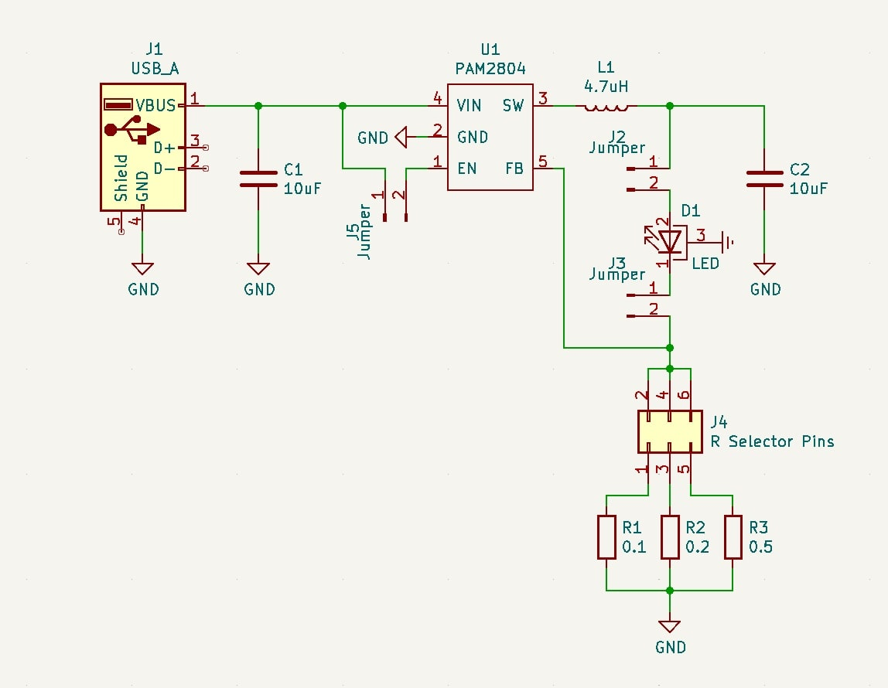

# Flare 🔥

A high efficiency constant current lighting module for high-powered LEDs.

## V0.2

Based around the [PAM2804](https://www.diodes.com/assets/Datasheets/PAM2804.pdf) 1A step-down LED driver, and [Cree XLamp® XP-E2](https://cree-led.com/media/documents/XLampXPE2.pdf) photo red (650nm) LED. Powered from a USB Type A connector, but can be modified to be powered from a lithium-ion/po battery thanks to the wide range of input voltages supported by the PAM2804 (2.5 to 6.0V).

